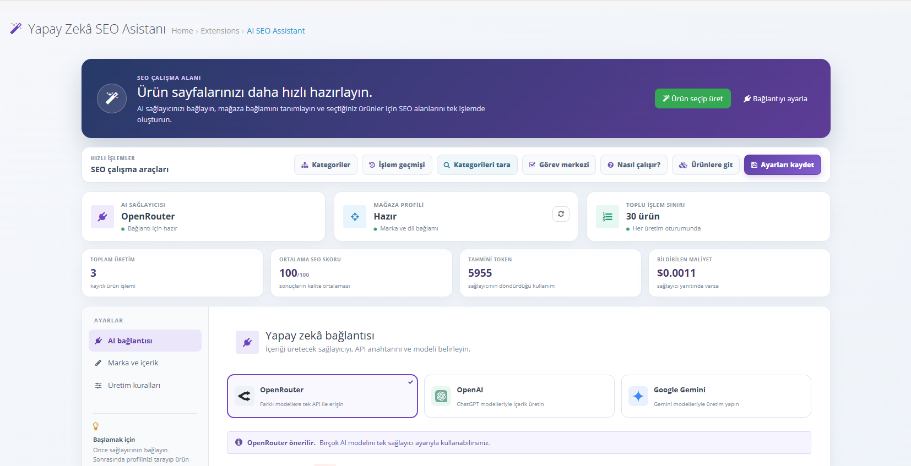
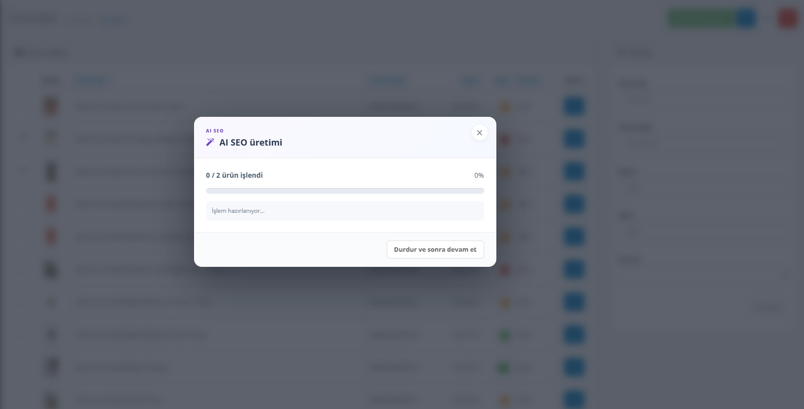
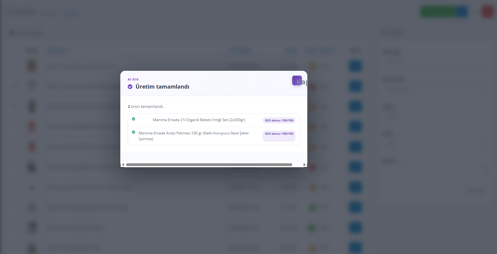
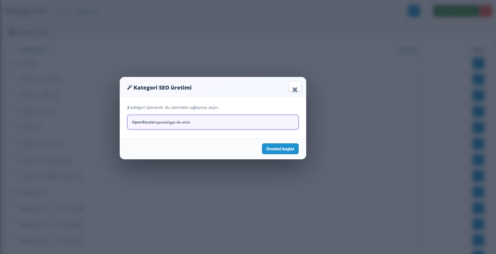
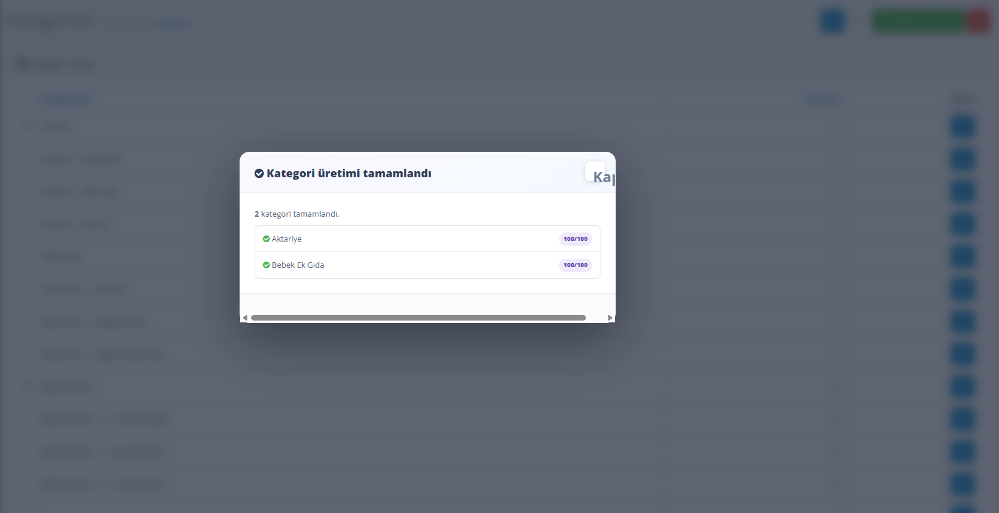
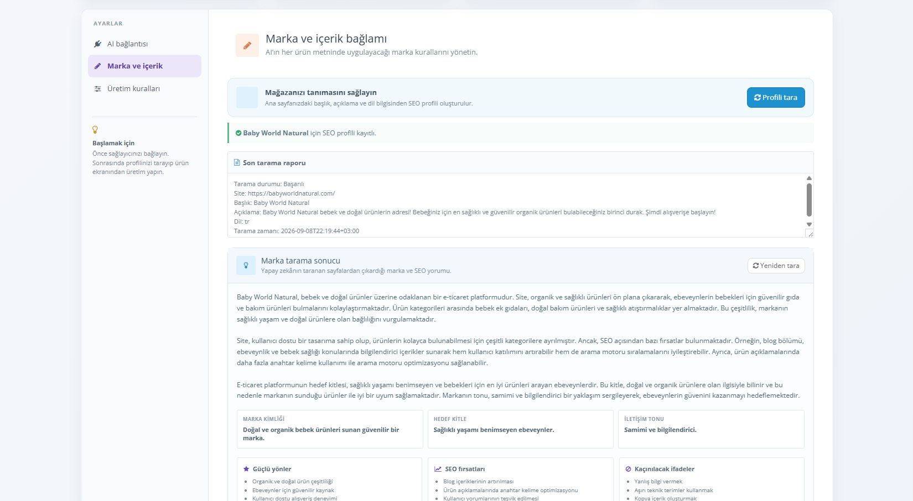
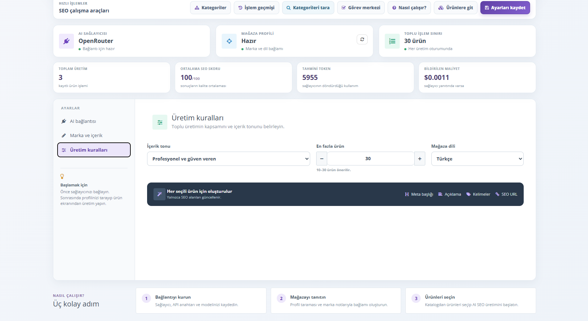
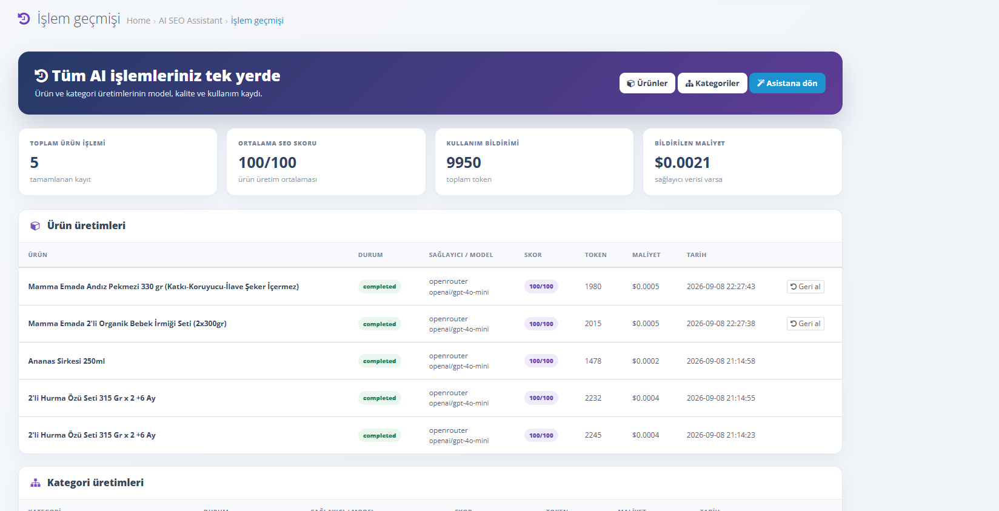

  <strong>EN</strong> · <a href="#turkce">TR</a>

# AI SEO Assistant for OpenCart 3

Create consistent, reviewable product and category SEO content directly from the OpenCart admin panel. The extension connects to OpenRouter, OpenAI, or Google Gemini and keeps a history of generated work.

> Designed for OpenCart 3.0.3.x. The default interface language is Turkish; generated content follows your configured store language.

## What it does

- Generates product meta titles, meta descriptions, keywords, SEO URLs, tags, suitable categories, AI-ready summaries, and short FAQs.
- Generates category descriptions, meta fields, keywords, and SEO URLs.
- Scans store pages and optional public competitor URLs for brand, search-intent, and content-opportunity signals.
- Lets you select the AI provider and model for each production queue.
- Tracks provider, model, SEO score, token usage, estimated cost, and generated history.
- Offers a task center for missing product data, duplicate SEO signals, intent clusters, and schema checks.
- Saves snapshots for new product generations so eligible history records can be rolled back.
- Checks the official GitHub Releases feed and installs verified OCMOD updates directly from the extension dashboard.

## Screenshots

Screenshots are stored in `docs/images/`. The main dashboard is available now; the remaining screens will be added once supplied.

### Main dashboard

| Screen | Planned file | What it should show |
| --- | --- | --- |
| Main dashboard | `01-dashboard.png` | AI provider cards, quick actions, and workspace tabs |
| Product generation — progress | `02-product-modal-progress.png` | Progress state and pause control |
| Product generation — completed | `03-product-modal-complete.png` | Completed queue and SEO score results |
| Category generation — provider selection | `04-category-modal-select.png` | Category queue and provider selection |
| Category generation — completed | `05-category-modal-complete.png` | Completed category queue and SEO scores |
| Brand / competitor scan | `06-brand-scan.png` | Intent analysis and competitor insight cards |
| Task center | `07-task-center.png` | Duplicate, missing-data, intent, and schema panels |
| History and rollback | `08-history.png` | History table and the rollback action |

### Product SEO generation modal

<table><tr><td width="50%"></td><td width="50%"></td></tr><tr><td align="center">Progress and pause state</td><td align="center">Completed queue with SEO scores</td></tr></table>

### Category SEO generation modal

<table><tr><td width="50%"></td><td width="50%"></td></tr><tr><td align="center">Provider selection before the queue begins</td><td align="center">Completed category queue with SEO scores</td></tr></table>

### Brand and competitor scan

### SEO task center access

### History and rollback

## Installation

1. Download or build `ai-seo-assistant-v1.9.4.ocmod.zip`.
2. In OpenCart Admin, open **Extensions → Installer** and upload the ZIP file.
3. Open **Extensions → Modifications** and click **Refresh**.
4. Go to **Extensions → Extensions → Modules**.
5. Find **AI SEO Assistant**, click **Install**, then click **Edit**.
6. The gradient **AI SEO Assistant** entry appears as a separate link in the left navigation.

### Updating

Use **Check for updates** from the extension dashboard. When a newer official GitHub release is available, the extension downloads only the matching `ai-seo-assistant-v*.ocmod.zip` asset, validates its identity and version, creates a server-side backup of replaced files, installs it, and refreshes OpenCart modifications.

## First-time setup

1. Open **AI SEO Assistant** from the left navigation.
2. Pick one provider: **OpenRouter**, **OpenAI**, or **Google Gemini**.
3. Enter the provider API key and a model name, then choose **Save settings**.
4. Use **Scan profile** to collect your store’s language, metadata, and relevant internal-page signals.
5. Add brand rules, prohibited phrases, and—optionally—up to three public competitor URLs.

### Provider notes

- **OpenRouter:** use an OpenRouter API key and a model identifier such as `openai/gpt-4o-mini`.
- **OpenAI:** sign in to the OpenAI Platform, create an API key, then paste it into the extension. A ChatGPT subscription alone does not provide API authorization.
- **Google Gemini:** use a Google AI Studio API key and a compatible Gemini model.

## Product SEO workflow

1. Open **Catalog → Products**.
2. Select one or more products.
3. Click **AI SEO Generate**.
4. In the custom modal, select the provider/model to use for that queue.
5. Follow progress in the modal. The queue can be paused and continued in the same browser session.
6. Review the SEO score and generated result in **AI SEO Assistant → History**.

For each product, the extension updates SEO fields and may add suitable existing categories while preserving the product’s current category hierarchy. It also keeps the fixed `Ürünler` category when it exists.

## Category SEO workflow

1. Open **Catalog → Categories**.
2. Select categories and choose **Category SEO Generate**.
3. Select the provider in the modal and start the queue.
4. The extension updates category description, meta title, meta description, keywords, and the SEO URL.
5. Use **Scan categories** on the extension dashboard to find low-score or incomplete category SEO records.

## Task center and history

**SEO Task Center** helps prioritize work by reporting:

- Missing description, image, model, manufacturer, or attribute data.
- Duplicate meta titles, meta descriptions, and SEO URL signals.
- Informational, comparison, and transactional intent clusters.
- Product, FAQPage, and BreadcrumbList schema signals from theme templates.

**History** records product and category jobs. New product generation records retain the previous SEO snapshot; use **Rollback** to restore a supported product record.

## Important notes

- API keys are stored in the OpenCart settings database. Restrict admin access and rotate keys when necessary.
- The extension writes SEO URLs for the default store (`store_id=0`). Multi-store installations may need an additional implementation.
- A competitor scan reads only the public URLs you add. It does not check or guarantee Google rankings.
- AI-ready summaries and FAQ content improve structured, direct-answer content but cannot guarantee visibility in Google or AI search experiences.
- Review generated copy before publishing, especially product claims, certifications, health statements, pricing, and availability.

## License

This project uses the [AI SEO Assistant Community License](LICENSE), **not** the MIT License. You may use, study, modify, and share it for free, including in a commercial store. Selling, paid redistribution, or bundling the extension or a derivative into a paid product or service requires the copyright holder's prior written permission.

---

  <a href="#ai-seo-assistant-for-opencart-3">EN</a> · <strong>TR</strong>

# OpenCart 3 için AI SEO Asistanı

OpenCart yönetim panelinden ürün ve kategori SEO içeriklerini daha tutarlı şekilde üretmenizi sağlayan yapay zekâ eklentisi. OpenRouter, OpenAI veya Google Gemini ile çalışır; üretilen işlemleri geçmişte saklar.

> OpenCart 3.0.3.x için tasarlanmıştır. README varsayılan olarak İngilizce açılır; bu bölüm Türkçe dokümantasyondur.

## Neler yapar?

- Ürünler için meta başlık, meta açıklaması, anahtar kelime, SEO URL, etiket, uygun kategori, AI arama özeti ve kısa SSS üretir.
- Kategoriler için açıklama, meta alanları, anahtar kelime ve SEO URL oluşturur.
- Mağaza ve isteğe bağlı rakip URL’lerini tarayarak marka, arama niyeti ve içerik fırsatlarını çıkarır.
- Her üretim kuyruğunda kullanılacak sağlayıcı ve modeli seçtirir.
- Sağlayıcı, model, SEO skoru, token, tahmini maliyet ve işlem geçmişini kaydeder.
- Eksik ürün verisi, yinelenen SEO sinyali, niyet kümeleri ve şema kontrolleri için görev merkezi sunar.
- Yeni ürün üretimlerinde önceki SEO değerlerini saklayarak uygun kayıtlarda geri alma imkânı verir.
- Resmî GitHub Releases yayınlarını denetler; doğrulanmış OCMOD güncellemelerini eklenti ekranından doğrudan kurar.

## Görseller

Görseller `docs/images/` klasöründe tutulur. Ana ekran eklendi; diğer ekranlar geldikçe aşağıdaki sırayla eklenecek:

### Ana eklenti ekranı

### Ürün SEO üretim modalı

<table><tr><td width="50%"></td><td width="50%"></td></tr><tr><td align="center">İlerleme ve durdurma durumu</td><td align="center">Tamamlanan kuyruk ve SEO skorları</td></tr></table>

### Kategori SEO üretim modalı

<table><tr><td width="50%"></td><td width="50%"></td></tr><tr><td align="center">Kuyruk öncesi sağlayıcı seçimi</td><td align="center">Tamamlanan kategori kuyruğu ve SEO skorları</td></tr></table>

### Marka ve rakip taraması

### SEO görev merkezi erişimi

### İşlem geçmişi ve geri alma

1. `01-dashboard.png` — eklentinin ana ekranı
2. `02-product-modal-progress.png` — ürün üretim ilerleme modalı
3. `03-product-modal-complete.png` — ürün üretimi tamamlandı modalı
4. `04-category-modal-select.png` — kategori üretimi sağlayıcı seçim modalı
5. `05-category-modal-complete.png` — kategori üretimi tamamlandı modalı
6. `06-brand-scan.png` — marka/rakip tarama sonucu
7. `07-task-center.png` — SEO görev merkezi
8. `08-history.png` — işlem geçmişi ve geri alma

## Kurulum

1. `ai-seo-assistant-v1.9.4.ocmod.zip` paketini indirin veya oluşturun.
2. OpenCart yönetim panelinde **Eklentiler → Yükleyici** ekranını açıp ZIP dosyasını yükleyin.
3. **Eklentiler → Değişiklikler** ekranında **Yenile** düğmesine basın.
4. **Eklentiler → Eklentiler → Modüller** ekranına gidin.
5. **AI SEO Assistant** satırını kurun ve düzenleyin.
6. Sol menüde gradient arka planlı **AI SEO Asistanı** bağlantısını kullanın.

### Güncelleme

Eklenti ana ekranındaki **Güncellemeleri denetle** düğmesini kullanın. Yeni bir resmî GitHub yayını bulunduğunda yalnızca sürümle eşleşen `ai-seo-assistant-v*.ocmod.zip` paketi indirilir; paket kimliği ve sürümü doğrulanır, değişecek dosyalar sunucuda yedeklenir, kurulum yapılır ve OpenCart değişiklikleri otomatik yenilenir.

## İlk ayarlar

1. Sol menüden **AI SEO Asistanı** ekranını açın.
2. OpenRouter, OpenAI veya Google Gemini sağlayıcısından birini seçin.
3. API anahtarını ve modeli girip **Ayarları kaydet** düğmesine basın.
4. **Profili tara** ile mağazanızın dil, meta ve ilgili sayfa sinyallerini çıkarın.
5. Marka notlarını, yasaklı ifadeleri ve isterseniz en fazla üç açık rakip URL’sini ekleyin.

### Sağlayıcı notları

- **OpenRouter:** OpenRouter API anahtarı ve `openai/gpt-4o-mini` benzeri model kimliği gerekir.
- **OpenAI:** OpenAI Platform hesabından oluşturduğunuz API anahtarını kullanın. Sadece ChatGPT aboneliği API erişimi sağlamaz.
- **Google Gemini:** Google AI Studio API anahtarı ve uyumlu Gemini modeli gerekir.

## Ürün SEO kullanımı

1. **Katalog → Ürünler** ekranına gidin.
2. Ürünleri seçin.
3. **AI SEO Üret** düğmesine basın.
4. Özel modalda kullanılacak sağlayıcı ve modeli seçin.
5. İlerlemeyi modalda izleyin; aynı tarayıcı oturumunda işlemi durdurup devam ettirebilirsiniz.
6. Sonuçları ve SEO skorunu **AI SEO Asistanı → İşlem geçmişi** ekranında inceleyin.

Ürün üretimi mevcut kategori hiyerarşisini korur, AI’ın uygun bulduğu mevcut kategorileri ekler ve varsa sabit `Ürünler` kategorisini korur.

## Kategori SEO kullanımı

1. **Katalog → Kategoriler** ekranına gidin.
2. Kategorileri seçip **Kategori SEO Üret** düğmesine basın.
3. Modalda sağlayıcıyı seçip kuyruğu başlatın.
4. Kategori açıklaması, meta başlık, meta açıklaması, anahtar kelimeler ve SEO URL güncellenir.
5. Ana ekrandaki **Kategorileri tara** ile eksik veya düşük skorlu kayıtları inceleyin.

## Görev merkezi ve geçmiş

**SEO Görev Merkezi** şu kontrolleri bir arada sunar:

- Eksik açıklama, görsel, model, marka veya özellik alanları
- Yinelenen meta başlık, meta açıklaması ve SEO URL sinyalleri
- Bilgi, karşılaştırma ve satın alma niyeti kümeleri
- Tema dosyalarındaki Product, FAQPage ve BreadcrumbList schema sinyalleri

**İşlem geçmişi**, ürün ve kategori işlemlerini kaydeder. Yeni ürün üretimlerinden sonra oluşan uygun geçmiş kaydında **Geri al** düğmesiyle eski SEO değerlerine dönülebilir.

## Önemli notlar

- API anahtarları OpenCart ayar veritabanında saklanır; yönetici erişimini güvenli tutun.
- Eklenti SEO URL kayıtlarını varsayılan mağaza (`store_id=0`) için yazar. Çok mağazalı yapılar ek geliştirme gerektirebilir.
- Rakip taraması yalnızca eklediğiniz herkese açık URL’leri okur; Google sıralamasını kontrol etmez ve sonuç garantisi vermez.
- AI arama özeti ve SSS, doğrudan cevaplanabilir içeriği güçlendirir; Google veya AI arama sonuçlarında görünürlük garantisi vermez.
- Üretilen metinleri yayına almadan önce iddia, sertifika, sağlık, fiyat ve stok bilgisi açısından kontrol edin.

## Lisans

Bu proje MIT değil, [AI SEO Assistant Community License](LICENSE) ile lisanslanır. Eklentiyi ücretsiz olarak kullanabilir, inceleyebilir, geliştirebilir ve paylaşabilirsiniz; ticari mağazanızda ücretsiz kullanım da serbesttir. Eklentinin veya türetilmiş bir sürümünün satılması, ücretli yeniden dağıtımı ya da ücretli ürün/hizmete paketlenmesi için telif sahibinden yazılı izin alınması gerekir.
